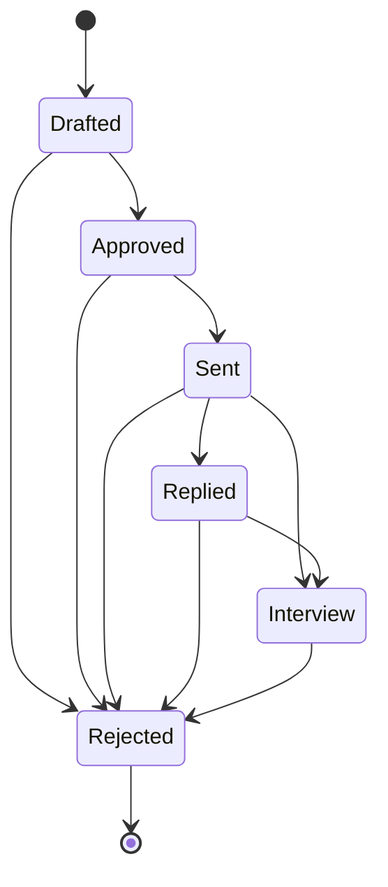

# Phase 4 — Human-in-the-Loop Approval Workflow

> **Goal of this doc:** teach you *why* the approval workflow is modeled as
> data (a transition table), not code (a chain of `if` statements) — and why
> that distinction matters enough to refactor three modules for it.

> **Built after Phase 5, on purpose.** Phase 5 (Power BI) was designed
> directly against the Phase 1 schema contract — `is_approved` and
> `outreach_status` already existed as columns, so the dashboard's funnel
> measures could be authored before this phase's application code existed
> to populate them. This phase is what actually writes to those columns,
> and along the way it closes a gap Phase 5 found and documented (see §5).

---

## 1. What "human-in-the-loop" actually means here

Nothing in this project ever emails a recruiter automatically. Every
outreach starts as `'Drafted'` — created by Phase 3's
`upsert_outreach_result()` the moment the ATS engine scores a job — and can
only reach `'Sent'` after a person explicitly approves it. `is_approved`
exists in the Phase 1 schema for exactly this purpose (see the comment on
it in `sql/01_schema.sql`: *"human-in-the-loop gate"*). This phase builds
that gate, plus the rest of the lifecycle it sits inside.

---

## 2. The state machine: one table, not a chain of `if`s

```python
ALLOWED_TRANSITIONS = {
    "Drafted":   {"Approved", "Rejected"},
    "Approved":  {"Sent", "Rejected"},
    "Sent":      {"Replied", "Interview", "Rejected"},
    "Replied":   {"Interview", "Rejected"},
    "Interview": {"Rejected"},
    "Rejected":  set(),
}
```



Three design decisions worth explaining:

- **`Rejected` is terminal** (empty set, no outgoing edges) and **reachable
  from every other status**. A recruiting funnel can end at any stage — a
  drafted outreach might never get approved, an approved one might get
  rejected before sending, a sent one might get a rejection reply. Encoding
  "reject from anywhere" as one shared destination, rather than a separate
  `RejectedFromDrafted`/`RejectedFromSent`/etc., keeps the graph honest
  about what's actually one concept.
- **`Sent -> Interview` is a direct edge**, skipping `Replied`. Some
  recruiters invite you to interview without a distinct "reply" step the
  system would otherwise observe (a phone call, a message outside the
  tracked channel). Modeling only the *strictly* linear path would make a
  perfectly normal real-world outcome look like an "invalid" state
  transition — a good reminder that a state machine should match how the
  process actually behaves, not an idealized version of it.
- **No backwards edges, ever.** Once `Sent`, never back to `Drafted`. This
  isn't a limitation — outreach history should be an append-only record of
  what actually happened, not something that gets silently rewound.

### Why a table instead of `if current == "Drafted": ...` scattered across functions

The alternative — each function (`approve_outreach`, `mark_sent`, ...)
independently hardcoding which statuses it accepts — creates a graph that
exists only implicitly, spread across five function bodies, with no single
place to see or test it as a whole. Worse: two independent descriptions of
the same graph *will* drift eventually (add a new status, forget to update
one function's check). `ALLOWED_TRANSITIONS` is queried, not duplicated:

```python
def _predecessors_of(to_status: str) -> Set[str]:
    return {frm for frm, tos in ALLOWED_TRANSITIONS.items() if to_status in tos}

def approve_outreach(engine, outreach_id):
    _transition(engine, outreach_id, allowed_from=_predecessors_of("Approved"), ...)
```

`approve_outreach` never states "Drafted" anywhere — it asks the table "who
can reach Approved?" The table is the only place the graph is written down.
`tests/test_workflow_state_machine.py::test_predecessors_of_matches_can_transition_both_directions`
proves the query and the direct lookup can never disagree, because they're
answering the same question against the same data.

---

## 3. Concurrency safety: `SELECT ... FOR UPDATE`

Every transition locks its row before checking anything:

```python
row = conn.execute(
    select(fact_outreach.c.outreach_status, fact_outreach.c.is_approved)
    .where(fact_outreach.c.outreach_id == outreach_id)
    .with_for_update()
).first()
```

**Without the lock:** two concurrent calls to `approve_outreach` for the
same `outreach_id` (a double-click on a review UI, or a review UI racing a
webhook) could both read `outreach_status = 'Drafted'`, both pass the "is
this transition legal?" check, and both write `'Approved'` — harmless here,
but the same race against `mark_sent` could produce two `sent_at`
timestamps, or worse, two actual outbound sends. **With the lock:** the
second transaction's `SELECT ... FOR UPDATE` blocks until the first commits,
then reads the *already-updated* status and correctly raises
`InvalidTransitionError` on the now-illegal second transition. This is the
proper fix for the same class of problem Phase 2's `get_or_create_company()`
docstring calls out as a known, *unfixed* gap for the no-domain path (see
`docs/02-ingestion-and-enrichment.md` §5) — here, the fix is applied.

---

## 4. Defense in depth: `require_is_approved` in `mark_sent`

```python
def mark_sent(engine, outreach_id):
    _transition(
        engine, outreach_id,
        allowed_from=_predecessors_of("Sent"),
        to_status="Sent",
        extra_values={"sent_at": func.now()},
        require_is_approved=True,
    )
```

Under normal operation, this check can never fire: status only reaches
`'Approved'` via `approve_outreach()`, which sets `is_approved = TRUE` in
the *same transaction* as the status change — the two columns are updated
together, so they can never observably disagree. So why check
`is_approved` again here at all?

Because the literal requirement is "approve/reject **before anything is
sent**" — about the `is_approved` flag specifically, not just about
whatever label happens to be in `outreach_status`. Trusting the status
string alone (`if status == "Approved": send()`) is trusting a proxy for
the real invariant. Checking `is_approved` directly in `mark_sent` means
even a hypothetical future bug that let `outreach_status` reach
`'Approved'` through some other path (a bad migration, a manual `UPDATE`,
a bug in a function added later) still can't produce a send — the gate
lives at the point of highest consequence (the send), not just at the
point where the two columns are *supposed* to be kept in sync. Same
"defense in depth" instinct as validating a Pydantic model's bounds *and*
enforcing the same bound with a database `CHECK` constraint (Phase 1/3).

---

## 5. Closing a gap Phase 5 found: `interviewed_at`

Designing the Power BI layer *before* this phase existed (Phase 5,
`docs/05-power-bi-data-model.md`) surfaced a real schema gap: `fact_outreach`
had `drafted_at`, `sent_at`, `replied_at`, but no timestamp for reaching the
`'Interview'` stage — so `Interview Rate %` had no choice but to filter on
`outreach_status = "Interview"`, a snapshot that silently undercounts any
outreach that later moves on to `'Rejected'` (interviews don't always lead
to an offer).

This phase closes it. **Migration #4**
(`sql/04_interviewed_at_column.sql`) adds `interviewed_at TIMESTAMPTZ`,
`mark_interview()` sets it once, and the Phase 5 DAX/docs were updated in
lockstep — `powerbi/eagent_measures.dax`'s `Interview Rate %` now filters on
`NOT ISBLANK(interviewed_at)`, matching the same pattern `Sent Outreach
Count` already used for `sent_at`. The old, now-inaccurate version is kept
**struck through** in `docs/05-power-bi-data-model.md` rather than deleted —
a record that the gap was found, not quietly patched over and forgotten.

This is worth internalizing as a pattern, not a one-off fix: **designing a
consumer (a dashboard) against a producer's schema before the producer
exists is a legitimate way to find gaps early** — the DAX literally couldn't
express "how many reached interview" cleanly until the schema could
represent it, and that friction is what surfaced the missing column.

---

## 6. Consolidating the schema mapping: `eagent/schema.py`

Phase 2's `loader.py` and Phase 3's `ats/loader.py` each defined their own
partial `Table` object for `dim_companies`/`dim_jobs`/`fact_outreach` —
reasonable while each phase stood alone, mapping only the columns it
touched. This phase's `workflow.py` needed yet another,
overlapping-but-not-identical view of `fact_outreach` (it needs
`outreach_status` and `is_approved`, which the Phase 3 loader deliberately
*doesn't* map — see that module's docstring for why). A third divergent
copy would mean three places that could silently drift from the real
schema and from each other.

`eagent/schema.py` is the fix: one shared `Table` per dimension/fact,
imported everywhere instead of redefined. `eagent.loader` and
`eagent.ats.loader` were both refactored to import from it (their logic is
unchanged — only where the `Table` objects come from). This is the same
"rule of three" instinct that produced `ALLOWED_TRANSITIONS` in §2: the
first duplication is fine, the second is a coincidence, the third is a
pattern worth naming once instead of writing a fourth time.

---

## 7. The review queue and CLI

`get_pending_approvals()` joins `fact_outreach` → `dim_jobs` → `dim_companies`
for every `Drafted`-and-unapproved row, ordered by `ats_score` descending
(review the best matches first). `scripts/manage_outreach.py review` walks
through them interactively:

```bash
python scripts/manage_outreach.py review --limit 10
```

```
------------------------------------------------------------------------
outreach_id=42   ats_score=88.5
Senior Data Engineer @ Acme Analytics
job_url: https://...
missing_skills: snowflake
resume_pdf_path: output/resumes/job-17.pdf
[a]pprove / [r]eject / [s]kip / [q]uit:
```

`sent`/`replied`/`interview` are exposed as direct CLI commands
(`python scripts/manage_outreach.py sent 42`) because those events would
normally arrive from somewhere else — an email-tracking webhook, a calendar
integration — that doesn't exist yet in this portfolio project. Exposing
them as CLI commands means the whole funnel is drivable and testable end to
end without those integrations.

---

## 8. Interview checklist ✅

- [ ] Why is `ALLOWED_TRANSITIONS` one dict instead of a check inside each
      transition function?
- [ ] Why is `Rejected` reachable from every non-terminal status instead of
      only from `Drafted`?
- [ ] What real-world scenario does the `Sent -> Interview` direct edge model?
- [ ] What race condition does `SELECT ... FOR UPDATE` prevent here, and
      what would go wrong without it?
- [ ] Why does `mark_sent` check `is_approved` directly instead of trusting
      that `outreach_status == "Approved"` already implies it?
- [ ] What gap did Phase 5's Power BI design work surface, and how did this
      phase close it — in the schema, the application code, *and* the DAX?
- [ ] Why did three separate `Table` mappings get consolidated into
      `eagent/schema.py` instead of just adding a fourth in `workflow.py`?

---

### Files in this phase
- `sql/04_interviewed_at_column.sql` — Migration #4
- `src/eagent/schema.py` — the shared Table mappings (new; also adopted by `eagent.loader` and `eagent.ats.loader`)
- `src/eagent/workflow.py` — `ALLOWED_TRANSITIONS`, the transition functions, `get_pending_approvals()`
- `scripts/manage_outreach.py` — the review queue + funnel-advancing CLI
- `tests/test_workflow_state_machine.py` — pure, DB-free state machine tests
- `tests/test_workflow_integration.py` — DB-gated integration test for the real transactions/locking

**Next up → Phase 5, revisited:** once the `dim_jobs -> dim_dates` gap
(the other one Phase 5 flagged, still open) is closed, or once real data
flows through this workflow, the dashboard can be validated against real
funnel numbers instead of a designed-but-unexecuted schema.
