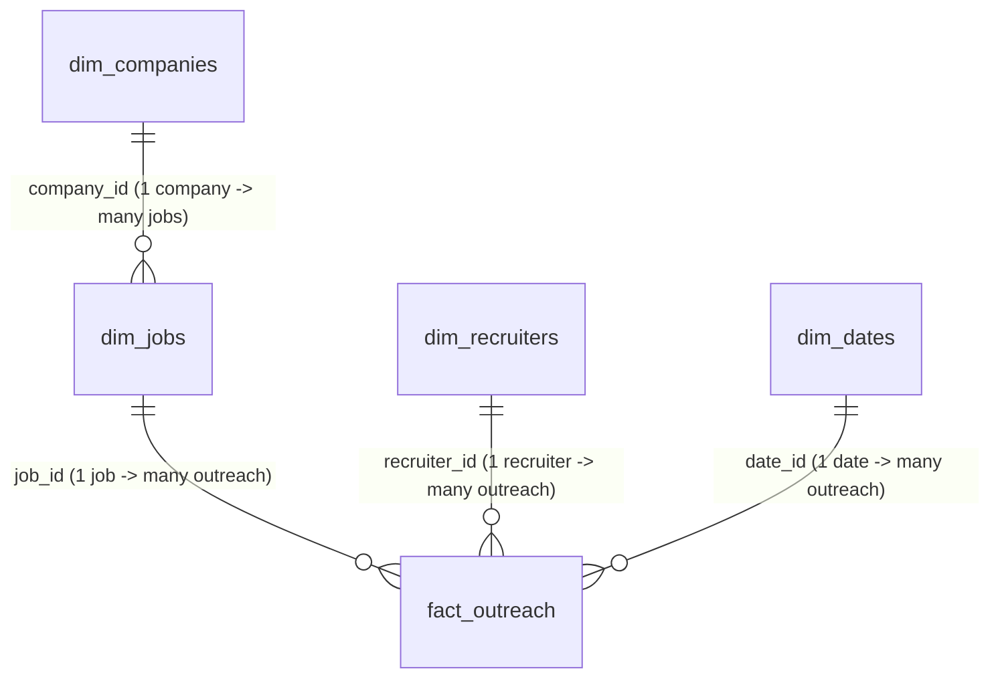

# Phase 5 — Power BI Data Model & DAX

> **Goal of this doc:** teach you *why* the relationship model and every DAX
> measure are built the way they are — including two real gaps in the
> current schema that this design work surfaced. If you can explain the
> trade-offs here, you understand semantic-layer modeling at an Analytics
> Engineer level, not just DAX syntax.

> ⚠️ **Honesty note, in keeping with this repo's "verify before you claim it
> works" rule (see CLAUDE.md / project conventions):** Phases 1–3 were
> executed and verified for real — SQL ran against test data, Python tests
> passed, a real PDF compiled. Power BI Desktop is a Windows GUI application
> I have no way to run in this environment, so the DAX below is
> **authored to be correct, not executed and confirmed**. Paste it into a
> real `.pbix` against the Phase 1–3 schema and treat any error message as
> more trustworthy than this doc. The relationship/cardinality guidance is
> standard, well-established Power BI modeling practice and lower-risk than
> the DAX syntax itself.

---

## 1. Relationship architecture (requirement #1)

### The model



| Relationship | Cardinality | Cross-filter direction |
|---|---|---|
| `dim_dates[date_id]` → `fact_outreach[date_id]` | One-to-many | **Single**: dim_dates filters fact_outreach |
| `dim_jobs[job_id]` → `fact_outreach[job_id]` | One-to-many | **Single**: dim_jobs filters fact_outreach |
| `dim_recruiters[recruiter_id]` → `fact_outreach[recruiter_id]` | One-to-many | **Single**: dim_recruiters filters fact_outreach |
| `dim_companies[company_id]` → `dim_jobs[company_id]` | One-to-many | **Single**: dim_companies filters dim_jobs (which transitively filters fact_outreach) |

In every relationship, set the "1" side on the dimension, the "many" side on
`fact_outreach` (or `dim_jobs`, for the company edge), and cross-filter
direction to **Single** — filters flow *from* dimensions *into* facts, never
the other way. This is the standard, recommended setup for a star schema in
Power BI, for a concrete reason: bidirectional filtering lets a filter on
the fact table change what a dimension shows, which can create ambiguous
many-to-many-style filter paths the engine has to guess how to resolve.
Single-direction keeps every filter path unambiguous and every measure fast.

**Mark `dim_dates` as the official Date Table** (Modeling → Mark as Date
Table, using `dim_dates[date]`). This is what makes Power BI's built-in
time-intelligence functions (`DATEADD`, `SAMEPERIODLASTYEAR`, etc.) work
correctly — same reason Phase 1 built a dedicated calendar dimension instead
of relying on raw timestamps (see `docs/01-database-modeling-star-schema.md`
§5).

### A deliberate choice: `dim_companies` connects through `dim_jobs` only

`dim_recruiters` also has a `company_id` column (Phase 1 schema) — so in
principle you could draw a *second* relationship, `dim_companies[company_id]`
→ `dim_recruiters[company_id]`. I chose **not to build that second
relationship**, and it's worth understanding why:

- With both edges active, filtering by Company would reach `fact_outreach`
  through **two different paths** — through `dim_jobs` and through
  `dim_recruiters`. Power BI *can* handle this (it's not a closed loop), but
  it means every "by Company" visual is implicitly asking "which company
  posted the job, AND which company employs the recruiter" — and nothing in
  the schema guarantees those are the same company for a given outreach row.
- The task explicitly asked for **single-direction filtering from Dims to
  Fact** — a clean, unambiguous star, not a snowflake with two live paths to
  the same fact table.
- Practically: "which company is this outreach *for*" is unambiguously the
  job's company. The recruiter's `company_id` is enrichment metadata about
  the contact, not the primary reporting dimension.

**Recommendation:** keep the `dim_recruiters → dim_companies` relationship
**out of the model** (or import it but leave it *inactive*). Use
`dim_companies` exclusively as an outrigger off `dim_jobs` for "Company"
slicing.

### Two known gaps this design work surfaced

Neither blocks building the report today, but both are worth naming
explicitly rather than discovering silently later:

1. **`dim_jobs` has no relationship to `dim_dates`.** `dim_jobs.posted_at`
   is a raw timestamp column with no FK into the shared calendar dimension
   (only `fact_outreach.date_id` connects to `dim_dates`). That means
   **`Total Postings Scraped` will not respond to the report's main Date
   slicer** — it only reflects the *current* count of `dim_jobs` rows,
   filtered by Company if you slice on that, but never by date, because
   there's no relationship path from `dim_dates` back to `dim_jobs`.
   **Fix (future migration):** add a `posted_date_id INTEGER REFERENCES
   dim_dates(date_id)` column to `dim_jobs`, populated the same way
   `fact_outreach.date_id` is.
2. **No `interviewed_at` timestamp.** `fact_outreach` has `drafted_at`,
   `sent_at`, `replied_at` — but the funnel has an `outreach_status =
   'Interview'` stage with no matching timestamp. `Interview Rate %` (below)
   has to fall back to *current status*, which under-counts: if an outreach
   later moves to `'Rejected'` after an interview, the enum value changes
   and the interview stage becomes invisible to a status-based filter.
   **Fix (future migration):** add `interviewed_at TIMESTAMPTZ` to
   `fact_outreach`, set once when status first reaches `'Interview'`,
   independent of whatever it becomes afterward — same pattern as
   `sent_at`/`replied_at` already use.

---

## 2. Where to put the measures: a dedicated `_Measures` table

Create one empty table (Enter Data → no rows) named `_Measures`, hide it from
report view, and put every measure below on it instead of scattering them
across `fact_outreach`. This is a standard Power BI organization pattern: as
a model grows past a handful of measures, having them all in one place (with
Display Folders for grouping — e.g. "Funnel", "ATS") beats hunting through
every physical table to find where a measure lives. It has zero effect on
DAX correctness; it's pure maintainability.

---

## 3. The measures (requirement #2)

Every measure below is also in [`powerbi/eagent_measures.dax`](../powerbi/eagent_measures.dax)
for direct copy-paste. Explanations here; code there.

### `Total Postings Scraped`

```dax
Total Postings Scraped =
COUNTROWS ( dim_jobs )
```

Counts **dim_jobs rows**, not `fact_outreach` rows. This matters: a job is
loaded into `dim_jobs` the moment it's scraped (Phase 2), but a
`fact_outreach` row for it only exists once the ATS engine has scored it
(Phase 3 — `upsert_outreach_result` is what creates that row). Counting
`fact_outreach` here would silently undercount every scraped-but-not-yet-scored
posting. **Format:** Whole number, `#,##0`.

### `Pending Approvals Count`

```dax
Pending Approvals Count =
CALCULATE (
    COUNTROWS ( fact_outreach ),
    fact_outreach[outreach_status] = "Drafted",
    fact_outreach[is_approved] = FALSE
)
```

Multiple filter arguments inside one `CALCULATE` are implicitly ANDed — no
need for `FILTER()` here. **Why not `FILTER()`?** `FILTER()` forces the
engine to materialize a row-by-row scan; a direct boolean filter argument
lets Power BI push the predicate down more efficiently. Reach for `FILTER()`
only when a condition genuinely needs row context or spans multiple
measures — see `Average Days to Reply` below for a case that actually needs
it. **Format:** Whole number, `#,##0`.

### `Approval Rate %`

```dax
Approval Rate % =
VAR ApprovedCount =
    CALCULATE (
        COUNTROWS ( fact_outreach ),
        fact_outreach[is_approved] = TRUE
    )
VAR TotalDrafted =
    COUNTROWS ( fact_outreach )
RETURN
    DIVIDE ( ApprovedCount, TotalDrafted, BLANK () )
```

`TotalDrafted` is just `COUNTROWS(fact_outreach)` because **every** outreach
row starts life as `'Drafted'` (the DB default — see
`src/eagent/ats/loader.py`), so "all fact_outreach rows" and "all
ever-drafted outreach" are the same set. `DIVIDE(x, y, BLANK())` is the DAX
idiom for safe division: a normal `x / y` throws an error (and can crash a
whole visual) when `y` is 0; `DIVIDE`'s third argument is the value to return
instead — `BLANK()` here, so Power BI renders it as an empty cell rather than
a divide-by-zero error or a misleading `0%`. **Every ratio measure in this
doc follows this same pattern.** **Format:** Percentage, 1 decimal, `0.0%`.

### `Sent Outreach Count`

```dax
Sent Outreach Count =
CALCULATE (
    COUNTROWS ( fact_outreach ),
    NOT ISBLANK ( fact_outreach[sent_at] )
)
```

Deliberately filters on `NOT ISBLANK(sent_at)`, **not** `outreach_status =
"Sent"`. The status column is a snapshot of the *current* stage — an
outreach that has since moved on to `'Replied'` or `'Interview'` no longer
equals `"Sent"`, even though it absolutely was sent. `sent_at` is a
timestamp that, once set, stays set regardless of what happens next —
exactly the "lifecycle timestamps for funnel metrics" use case the Phase 1
schema comment calls out (`sql/01_schema.sql`, `fact_outreach.sent_at`).
This is the general rule for any "how many reached at least stage X" metric
in this model: prefer the stage's timestamp over the current status.
**Format:** Whole number, `#,##0`.

### `Response Rate %`

```dax
Response Rate % =
VAR RepliedCount =
    CALCULATE (
        COUNTROWS ( fact_outreach ),
        NOT ISBLANK ( fact_outreach[replied_at] )
    )
VAR SentCount =
    [Sent Outreach Count]
RETURN
    DIVIDE ( RepliedCount, SentCount, BLANK () )
```

Reuses the `[Sent Outreach Count]` measure rather than recomputing the same
logic — DAX measures can reference other measures, and doing so keeps the
"what counts as Sent" definition in exactly one place. If that definition
ever changes, every measure built on it updates automatically. **Format:**
Percentage, 1 decimal, `0.0%`.

### `Interview Rate %`

```dax
Interview Rate % =
VAR InterviewCount =
    CALCULATE (
        COUNTROWS ( fact_outreach ),
        fact_outreach[outreach_status] = "Interview"
    )
VAR SentCount =
    [Sent Outreach Count]
RETURN
    DIVIDE ( InterviewCount, SentCount, BLANK () )
```

Expressed **as a percentage of Sent** (not of Replied) so every funnel-stage
measure in the dashboard shares the same denominator and is directly
comparable at a glance. This is the one measure that has to fall back to
`outreach_status = "Interview"` instead of a timestamp — see gap #2 in
§1 above. Until `interviewed_at` exists, treat this measure as a **lower
bound**: it will under-count outreach that reached interview stage and later
moved to `'Rejected'`. **Format:** Percentage, 1 decimal, `0.0%`.

### `Average ATS Score`

```dax
Average ATS Score =
AVERAGE ( fact_outreach[ats_score] )
```

`AVERAGE()` already ignores blank/null values (the same way SQL's `AVG()`
does), and returns `BLANK()` rather than erroring when every row in the
current filter context has a null score — so the built-in aggregator already
gives us the "error handling" a manual `SUM/DIVIDE/COUNT` version would, with
less code. Reach for `DIVIDE`/`FILTER` when you need custom ratio logic
(as above); use the built-in aggregator when it already does the job.
**Format:** Decimal, 1 place, `0.0`.

### `Average Days to Reply`

```dax
Average Days to Reply =
AVERAGEX (
    FILTER (
        fact_outreach,
        NOT ISBLANK ( fact_outreach[sent_at] )
            && NOT ISBLANK ( fact_outreach[replied_at] )
    ),
    DATEDIFF ( fact_outreach[sent_at], fact_outreach[replied_at], DAY )
)
```

This is the measure that genuinely needs `FILTER()`: `AVERAGEX` needs a
**table** to iterate row-by-row (to compute a per-row day count), and the
"only rows that were both sent and replied" condition has to hold across two
columns evaluated together — that's exactly what `FILTER()` is for, unlike
`Pending Approvals Count` above where two independent column filters could
just be separate `CALCULATE` arguments.

**Why `DATEDIFF(..., DAY)` and not `replied_at - sent_at`?** Subtracting two
`TIMESTAMPTZ` columns directly gives a *fractional* number of days (it
includes the time-of-day component) — `1.35` days, not a clean day count.
`DATEDIFF` with an explicit `DAY` granularity returns a whole number of
calendar days, which is what "days to reply" means to a human reading the
dashboard. **Format:** Decimal, 1 place, `0.0`.

---

## 4. `ATS Tier` (requirement #3)

Provided as **both** a calculated column and a measure — they serve
different jobs, and knowing when to reach for which is itself worth
understanding.

```dax
ATS Tier =
SWITCH (
    TRUE (),
    ISBLANK ( fact_outreach[ats_score] ), BLANK (),
    fact_outreach[ats_score] < 70, "Low Match",
    fact_outreach[ats_score] <= 85, "Medium Match",
    "High Match"
)
```

`SWITCH(TRUE(), cond1, result1, cond2, result2, ..., default)` is the
idiomatic DAX pattern for multi-branch conditionals — it reads top-to-bottom
like a series of `ELSE IF`s, and is easier to extend than nesting `IF()`
calls. The boundary logic is an exact partition of all possible scores:
`< 70` is Low, `70 <= score <= 85` is Medium (`<= 85` here is correct because
we already know it's `>= 70` — everything below 70 was caught by the
previous branch), anything left over (`> 85`) falls to the final,
unconditional `"High Match"`.

**Use the calculated column as your default.** It's computed once per row
at data-refresh time (not on every visual interaction), and — critically —
it's the only form that works as a slicer, an axis, or a `Legend` field,
since those need one static value per row, not a value that depends on
whatever's currently filtered.

```dax
ATS Tier (Measure) =
VAR AvgScore = [Average ATS Score]
RETURN
    SWITCH (
        TRUE (),
        ISBLANK ( AvgScore ), BLANK (),
        AvgScore < 70, "Low Match",
        AvgScore <= 85, "Medium Match",
        "High Match"
    )
```

The measure version buckets the **aggregated** average score for whatever's
currently filtered — useful for a single KPI card that should say e.g. "High
Match" for the currently-filtered company/date range as a whole, which the
column version cannot do (a column has no concept of "the current filter
context's average," only "this row's own value").

**Sort order:** Power BI sorts text columns alphabetically by default —
which would order the tiers "High Match, Low Match, Medium Match," not the
logical Low → Medium → High. Fix it with the companion
`ATS Tier Sort Order` column in `powerbi/eagent_measures.dax` (values 1/2/3),
applied via **Column tools → Sort by Column** on `ATS Tier`.

---

## 5. Interview checklist ✅

- [ ] Why single-direction filtering (dims → fact), not bidirectional?
- [ ] Why does `dim_companies` connect through `dim_jobs` only, not also
      through `dim_recruiters`?
- [ ] Why won't `Total Postings Scraped` respond to a Date slicer as the
      model currently stands, and what schema change would fix it?
- [ ] Why does `Sent Outreach Count` filter on `sent_at`, not
      `outreach_status = "Sent"`? What's the general rule this implies for
      any "reached at least stage X" measure?
- [ ] Why does `Interview Rate %` need a caveat that the other rate measures
      don't?
- [ ] What does `DIVIDE(x, y, BLANK())`'s third argument do, and why is
      `BLANK()` usually the right choice over `0`?
- [ ] When do you reach for `FILTER()` inside `CALCULATE`/`AVERAGEX`, and
      when is a direct boolean filter argument better?
- [ ] Why does `Average Days to Reply` use `DATEDIFF(..., DAY)` instead of
      subtracting the two timestamp columns directly?
- [ ] Calculated column vs. measure for `ATS Tier` — which goes on a slicer,
      and why can't the other one?

---

### Files in this phase
- `docs/05-power-bi-data-model.md` — this doc
- `powerbi/eagent_measures.dax` — copy-paste-ready DAX for every measure above

**Next up → Phase 4** (numbered after this in the codebase, built out of
order): the human-in-the-loop approval workflow that actually sets
`is_approved` / advances `outreach_status` — the application logic this
dashboard's `Pending Approvals Count` and `Approval Rate %` measures are
built to report on.
